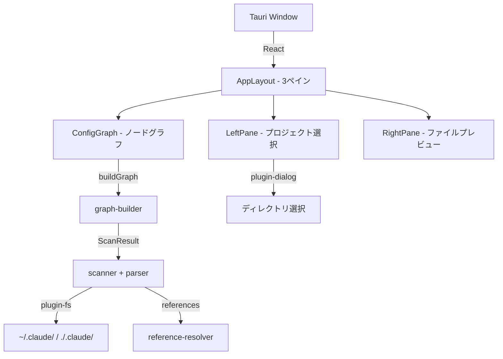

# 開発ルール

---

## 調査レポートの保存

WebFetchや外部調査を行った際は調査結果を保存する
調査レポートはテンプレート構造に従う

- テンプレート: ./.claude/research/template.md
- 保存先: ./.claude/research/YYYY-MM-DD_調査タイトル.md

---

## プロジェクト概要

### 基本情報

- **アプリケーション名**: cc-config
- **プロジェクトタイプ**: デスクトップアプリ（Tauri 2）

### ミッション

Claude Code の設定ファイルは `~/.claude/`（グローバル）と `./.claude/`（プロジェクト）に分散しており、スコープの合成結果が見えない。cc-config はこの設定体系をノードグラフで可視化し、設定の全体像を一目で把握できるようにする。

### ターゲットユーザー

Claude Code を日常的に使用し、複数プロジェクトで設定をカスタマイズしている開発者。設定ファイルの関係性や優先順位を視覚的に理解したいユーザー。

### アーキテクチャ図

**実態に合わせて都度更新**



---

## 技術スタック

- **ランタイム**: Tauri 2 (Rust バックエンド + WebView フロントエンド)
- **フロントエンド**: React 19 + TypeScript + Vite 7
- **グラフ描画**: @xyflow/react (React Flow v12)
- **ファイルアクセス**: @tauri-apps/plugin-fs + @tauri-apps/plugin-dialog
- **スタイリング**: Tailwind CSS v4
- **パッケージマネージャ**: pnpm

## ディレクトリ構成

```
src/
├── types/           # ドメイン型(config.ts)、グラフ型(graph.ts)
├── constants/       # スコープ別色定義(styles.ts)
├── lib/             # コアロジック
│   ├── scanner.ts           # 設定ファイル検出（fs プラグイン使用）
│   ├── parser.ts            # JSON/MD パース、@参照抽出
│   ├── reference-resolver.ts # @参照・hook参照・plugin参照の解決
│   └── graph-builder.ts     # ScanResult → Node[]/Edge[] 変換
├── hooks/           # React hooks (use-config-scan.ts)
└── components/
    ├── layout/      # AppLayout, LeftPane, RightPane
    ├── graph/       # ConfigGraph + nodes/ (ScopeGroupNode, CategoryNode, FileNode)
    └── preview/     # FilePreview

src-tauri/
├── src/             # lib.rs (プラグイン登録のみ), main.rs
├── capabilities/    # default.json (~/.claude/ 読取り権限)
└── tauri.conf.json
```

## 開発コマンド

```bash
pnpm tauri dev        # 開発サーバー起動
pnpm tauri build      # プロダクションビルド
npx tsc --noEmit      # 型チェック
```

## 設計判断

- **Rust カスタムコマンド不要**: ファイル読取りのみなので `@tauri-apps/plugin-fs` の JS API で完結
- **レイアウトは手動計算**: ノード数 20-30 程度なので dagre/elk 不要、グリッドベースで配置
- **状態管理は useState + props**: プロトタイプ段階では十分。必要になったら zustand 導入
- **編集機能なし（MVP）**: まず「見える」ことを優先、編集は将来の拡張
